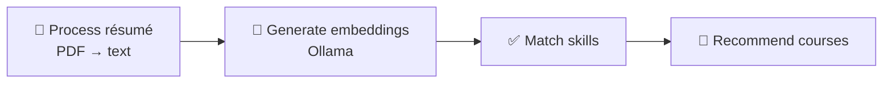

<div align="center">

# 🎓 Learning & Development AI Agent

**Upload an employee résumé and get extracted skills, skill gaps and personalized training recommendations.**


</div>

---

## ✨ Overview

An HR assistant that recommends **personalized training programs** for employees. A LangGraph pipeline reads a PDF résumé, finds which target skills the employee already has, which are missing, and suggests a course for each gap. Everything runs locally with [Ollama](https://ollama.com/).

## 🧩 Workflow



| Step | What happens |
|---|---|
| 📄 `process_resume` | Extracts text from the uploaded PDF with `pypdf` and detects known skills |
| 🧠 `generate_embeddings` | Creates a résumé embedding with `OllamaEmbeddings` (`llama3.2:1b`) |
| ✅ `match_skills` | Compares found skills against the skill database (Python, Machine Learning, Data Science, SQL, AWS) |
| 🎯 `recommend_courses` | Maps every missing skill to a course from the course database |

## 🚀 Getting Started

### Prerequisites

- Python 3.10+
- [Ollama](https://ollama.com/) running locally with the model pulled:

```bash
ollama pull llama3.2:1b
```

### Install & run

```bash
git clone https://github.com/Arashomranpour/HRAgent.git
cd HRAgent
pip install -r requirements.txt
streamlit run app.py
```

Open the app, upload a résumé PDF and review **Extracted Skills**, **Missing Skills** and **Recommended Training Programs**.

## 🔧 Customize

Edit `extract_skills` and the skill/course databases in `app.py` to match your organization's skills and training catalog.

## 📁 Project Structure

```
.
├── app.py            # LangGraph workflow + Streamlit UI
├── requirements.txt
├── todo.md           # App purpose / notes
└── LICENSE
```

## 🛠️ Tech Stack

`LangGraph` · `LangChain` · `Ollama` · `Streamlit` · `pypdf` · `pandas`

## 📄 License

Released under the [Apache 2.0 License](LICENSE).
